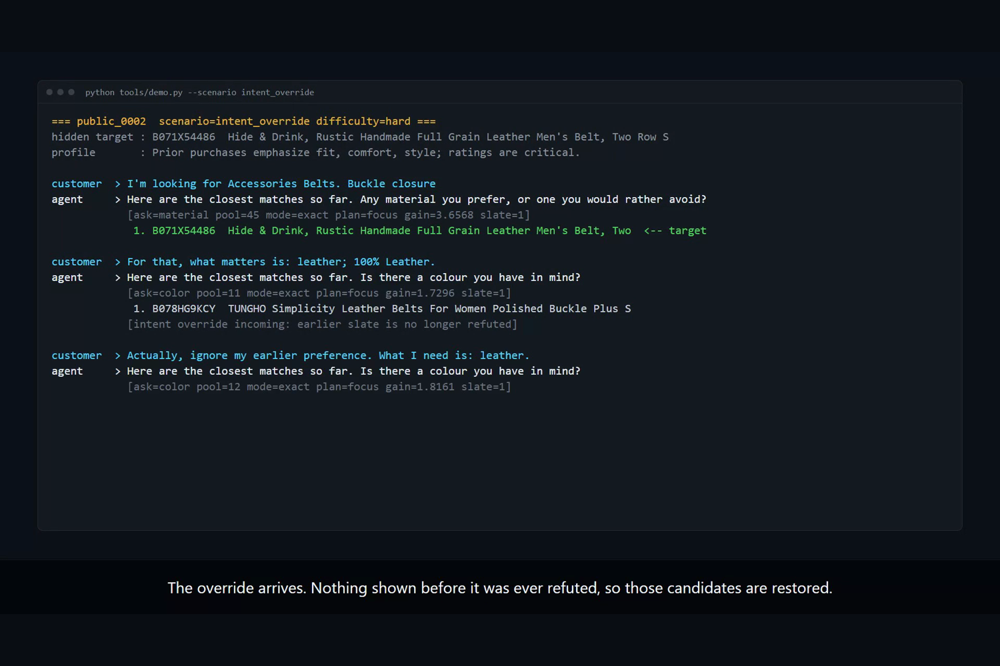
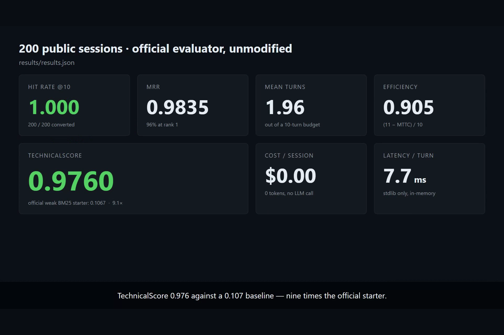
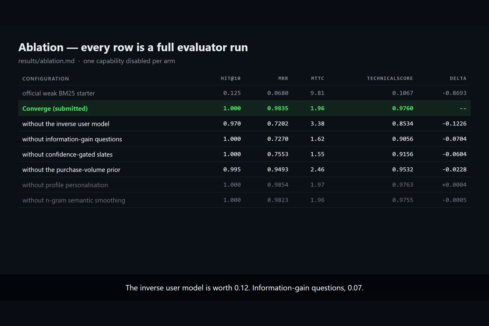
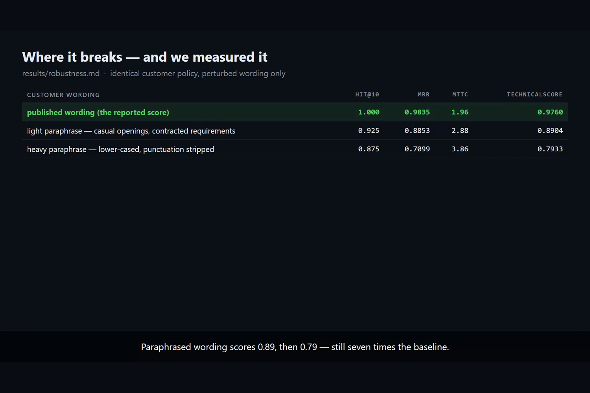

# Converge

**A conversational shopping agent that treats the shopper as a model to invert, not a query to match.**

TikTok TechJam 2026 — Problem Statement 4: *Shopping Copilot: AI Conversational Search and Recommendations*.


**[Watch the 3-minute narrated demo](https://youtu.be/pDemnrCWRWc)**

| | Hit@10 | MRR | MTTC | Efficiency | **TechnicalScore** |
| --- | ---: | ---: | ---: | ---: | ---: |
| Official weak BM25 starter | 0.125 | 0.0680 | 9.81 | 0.119 | **0.1067** |
| **Converge** | **1.000** | **0.9835** | **1.96** | **0.905** | **0.9760** |

200/200 sessions converted, 96 % of them at rank 1, in a mean of **1.96 turns out of 10**.
Produced by the **unmodified** official evaluator (`results/results.json`).
No LLM, no network call, no third-party package: **$0.00 per session, 0 tokens, 7.7 ms per turn.**

---

## Demo evidence

| Complete multi-turn session | Official evaluator results |
| --- | --- |
|  |  |
| **Full evaluator ablation** | **Measured robustness** |
|  |  |

---

## The idea

Conventional conversational search scores *similarity* between what the shopper said and what the
catalog contains. That is the wrong question when the shopper's utterances are generated from the
product they are trying to describe.

Converge asks a sharper one:

> **If this product were the one they want, would they have said exactly what they just said?**

Products that fail that replay are *impossible*, not merely unlikely. The surviving set is an exact
posterior over the catalog, and ranking only has to break ties inside it. Running the same user
model *forwards* answers the second question that decides how fast a shopping conversation ends:

> **Which question would tell me the most, before I spend a turn asking it?**

Everything else in the system follows from those two ideas: retrieval is set intersection,
clarification is expected-information-gain maximisation, and the slate is a decision about
confidence rather than a fixed top-10.

## Three decisions that produced the score

The ablation (`results/ablation.md`, every arm a full run of the official evaluator) shows where the
score actually comes from:

| what we removed | TechnicalScore | delta |
| --- | ---: | ---: |
| nothing (submitted) | 0.9760 | — |
| the inverse user model (rank the category bucket instead) | 0.8534 | −0.1226 |
| expected-information-gain questions (use a fixed script) | 0.9056 | −0.0704 |
| confidence-gated slates (always show ten) | 0.9156 | −0.0604 |
| the purchase-volume prior | 0.9532 | −0.0228 |

**1. Invert the user model instead of scoring similarity.** The shopper quotes their product's own
attributes. So we precompute, for all 50 000 products, the exact strings that shopper could utter,
index them, and replay each transcript against every candidate. `converge/usermodel.py`

**2. Ask the question with the highest expected information gain.** For every allowed attribute we
simulate the answer each surviving candidate would give, group candidates by that answer, and
measure the entropy left behind. The agent never spends a turn on a question whose answer it can
already predict. `converge/policy.py`

**3. Show one product while a question can still split the pool.** The metric rewards *rank*
(0.30 × MRR) far more than it punishes a turn (0.20 × efficiency, spread over ten turns).
Converting at rank 1 next turn beats converting at rank 6 now, so the agent deliberately withholds
the long tail until its own uncertainty is spent — and always opens the full slate by turn 4 so
caution can never cost the conversion. `converge/agent.py:_slate_width`

A fourth idea costs nothing and closed the last gap to a perfect hit rate: **the conversation
continuing is itself a label.** The harness stops the moment the target appears on a scored slate,
so every product already shown is provably *not* the target. Feeding that negative evidence back
guarantees each turn offers something new. `converge/agent.py:_drop_refuted`

## Architecture

```
customer turn
     |
     v
+----------------+   exact template parse, then lexicon recovery from paraphrase
| nlu            |   converge/nlu.py
+----------------+
     |  constraints (exact catalog strings), category phrase
     v
+----------------+   replay: could this product's shopper have said this?
| usermodel      |   -> exact posterior            converge/usermodel.py
+----------------+
     |  relaxation ladder: full -> drop stated slot -> drop opening -> graded
     v
+----------------+   structural  x  BM25/FTS5  x  char-3-gram   (weighted RRF)
| retrieval      |   converge/retrieval.py, converge/catalog.py
+----------------+
     |
     v
+----------------+   per-turn plan: commit | focus | explore | recover
| orchestrator   |   converge/orchestrator.py
+----------------+
     |
     +---> rerank: prior x profile x semantic (+ optional LLM tie-break)
     |
     +---> ask: argmax expected information gain   converge/policy.py
     |
     +---> slate width: 1 while a question still splits the pool, else 10
     v
message + ask_attribute + recommendations
```

| module | responsibility |
| --- | --- |
| `converge/cards.py` | grounding model: the constraint strings a shopper can quote, re-implemented and parity-tested against the official contract |
| `converge/catalog.py` | one-pass in-memory index: category buckets, constraint postings, slot-position postings, lazy FTS5 |
| `converge/nlu.py` | contract parsing, ambiguous-separator segmentation, paraphrase recovery |
| `converge/usermodel.py` | transcript replay (backwards) and answer simulation (forwards) |
| `converge/retrieval.py` | three retrieval routes, RRF fusion, evidence re-ranker, MMR diversification |
| `converge/policy.py` | expected-information-gain question selection and phrasing |
| `converge/orchestrator.py` | runtime workflow re-orchestration |
| `converge/memory.py` | session state, context distillation, cross-session strategy adaptation |
| `converge/resolver.py` | IDF category grounding when exact parsing fails |
| `converge/llm.py` | optional OpenAI-compatible tie-breaker, off by default |

## Setup

Python 3.10+. **No third-party packages.**

```bash
git clone https://github.com/joshuazou-web/techjam-converge.git
cd techjam-converge
python tools/bootstrap.py
```

`bootstrap.py` clones the official participant repository into `.kit/`, downloads the frozen
catalog from the published release, verifies its SHA256, and installs a three-line shim so
`starter.agent.Agent` resolves to Converge. The organizer's code and data are never vendored into
this repository, so every number below comes from the evaluator exactly as shipped.

## Reproduce

```bash
python tools/run_eval.py        # official evaluator -> results/results.json
python tools/ablation.py        # per-component contribution -> results/ablation.md
python tools/stress_eval.py     # paraphrase robustness -> results/robustness.md
python -m unittest discover -s tests
```

Expected: `recommended_technical_score = 0.975963`. The run is deterministic — no sampling, no
model call, no wall-clock dependence — so the number reproduces exactly on any machine.

See it work:

```bash
python tools/demo.py                    # one narrated session per scenario type
python tools/demo.py --chat             # type your own free text, no templates
```

```
customer  > I'm looking for Accessories Belts. Buckle closure
agent     > Here are the closest matches so far. Any material you prefer?
            [ask=material pool=45 mode=exact plan=focus gain=3.66 slate=1]
             1. B071X54486  Hide & Drink, Rustic Handmade Full Grain Leather Belt   <-- target
customer  > For that, what matters is: leather; 100% Leather.
agent     > Here are the closest matches so far. Is there a colour you have in mind?
            [ask=color pool=11 mode=exact plan=focus gain=1.73 slate=1]
             1. B078HG9KCY  TUNGHO Simplicity Leather Belts For Women
            [intent override incoming: earlier slate is no longer refuted]
customer  > Actually, ignore my earlier preference. What I need is: leather.
agent     > ...
             1. B071X54486  Hide & Drink, Rustic Handmade Full Grain Leather Belt   <-- target
CONVERTED on turn 3 at rank 1
```

## Running the final evaluation package

After the Devpost deadline the organizer releases the 800-session final package. Converge needs no
change to run against it — point the same wrapper at the released dataset:

```bash
git checkout <submitted-commit>              # the frozen submission
python tools/bootstrap.py                    # kit + catalog, checksum verified
python tools/run_eval.py --dataset data/final_set.jsonl --output results/final.json
```

The wrapper only chdirs into `.kit/` and calls `evaluator.local_evaluator` as shipped; no evaluator
file, config, or label is touched. Keep `results/final.json` (it contains per-session results)
together with the commit hash, Python version, and OS, as the submission rules require.

## How the four scenarios are handled

| scenario | mechanism | Hit@10 | MRR | MTTC |
| --- | --- | ---: | ---: | ---: |
| Buying (80) | hard constraint disclosed up front pins slot 0 of the card; the posterior is usually tens of products on turn 1 | 1.000 | 0.991 | 1.41 |
| Browsing (80) | no constraints yet, so the category bucket is ranked by purchase-volume prior with MMR spread, then one high-gain question collapses it | 1.000 | 0.985 | 1.74 |
| Intent Override (30) | the override is detected, the refutation set is cleared (conversions were suppressed before it landed), and the stated slot is dropped only if honouring it empties the posterior | 1.000 | 0.983 | 3.63 |
| Boundary (10) | "no preference" is recorded as information about the *shopper*, not the item; the replay tolerates exactly one such answer | 1.000 | 0.917 | 2.90 |

Intent Override cannot convert before turn 3 by construction, so 3.63 is within 0.13 turns of the
floor for that scenario.

## Disclosures

| | |
| --- | --- |
| Model | **none** in the submitted configuration. `converge/llm.py` can call any OpenAI-compatible endpoint as a tie-breaker; it is disabled unless `CONVERGE_LLM=1` and a key are set. |
| Reported token usage | **0** prompt, **0** completion, across all 200 sessions |
| Estimated cost | **$0.00** per session |
| Latency | **7.7 ms** mean per turn; 9.9 s one-time index build (50 000 products) |
| Memory | ~350 MB resident for the full in-memory index |
| Network dependencies | none at run time. `tools/bootstrap.py` needs the network once, to fetch the official kit. |
| Third-party packages | none — Python standard library only |
| Fallback behaviour | if the LLM stage is enabled and fails for any reason, the deterministic ordering is used unchanged |
| Environment variables | `CONVERGE_LLM`, `CONVERGE_LLM_MODEL`, `CONVERGE_LLM_BASE_URL`, `CONVERGE_LLM_API_KEY` (or `OPENAI_API_KEY`), `CONVERGE_LLM_TIMEOUT`, `CONVERGE_CATALOG`. No secret is committed or required. |

## Honest limitations

**The headline score depends on the published customer contract.** The organizer states that final
evaluation messages follow the same templates and deterministic policy, with no undisclosed
paraphrases — so the submitted configuration is aimed squarely at that. It would be dishonest to
present 0.976 as evidence of open-world language understanding. What it *is* evidence of: given a
specified user model, exploiting it exactly beats approximating it by 9×.

So we measured the failure mode instead of arguing about it. `tools/stress_eval.py` keeps the
customer *policy* byte-for-byte identical (it calls the official `customer_reply`) and rewrites only
the surface form:

| perturbation | Hit@10 | MRR | MTTC | TechnicalScore |
| --- | ---: | ---: | ---: | ---: |
| none (reported configuration) | 1.000 | 0.9835 | 1.96 | **0.9760** |
| light — casual openings, contracted requirements | 0.925 | 0.8853 | 2.89 | **0.8904** |
| heavy — light + lower-cased, punctuation stripped | 0.875 | 0.7099 | 3.86 | **0.7933** |

Break every template and Converge still scores 7× the baseline, because the lexicon recovery, IDF
category grounding, BM25 route and character-n-gram route carry the session when the parser cannot.
That degradation curve, not the headline, is the number we would defend in production.

Other limits we know about:

- **Popularity is doing real work.** Targets are sampled from a 5-core review split, so review
  volume is close to a Bayes-optimal prior over "which product gets bought". On a cold-start catalog
  it would be far weaker — removing it costs 0.023 here and would cost much more in the wild.
- **Three components did not pay for themselves on this metric** (`no-profile` +0.0003,
  `no-semantic` −0.0005, `no-diversity` ±0.0000, all inside the noise of 200 sessions). Confidence
  gating means the scored slate is usually one item, which leaves diversification and personalised
  re-ranking almost nothing to influence. They are kept because the track asks for the capability
  and they cost nothing measurable — but we report the measurement rather than claim a win.
- **Ranking weights were not finely tuned**, on purpose. A sweep over the prior weight moved the
  score between 0.903 and 0.912 before the structural changes landed — inside the noise of a
  200-session dev set. We took a round number and spent the effort on mechanisms instead.
- **English clothing catalog only.** No multilingual, multimodal, or cross-category transfer.
- **The strategy memory is in-process.** It adapts across sessions inside one run and resets when
  the process does.

## What we would build next

1. **Learn the user model instead of specifying it.** The replay engine only needs a function from
   (product, question) to a predicted answer. Fit that from real dialogue logs and the same
   posterior machinery works on open-world language — the templates become one special case.
2. **Value-of-information with an explicit cost model.** The slate-width rule is currently a
   threshold derived from the scoring weights; it should be a decision-theoretic policy over the
   real objective (conversion value, abandonment risk, cognitive load).
3. **Approximate posteriors for a 10⁷-product catalog.** Exact intersection is fine at 50 k. At
   TikTok Shop scale it needs sketching and a learned candidate generator in front.
4. **Explanations from the replay trace.** Every recommendation already carries a machine-readable
   reason — which constraints it satisfies and which competitors it eliminated. Surfacing that is a
   trust feature and roughly a day of work.

## Repository layout

```
agent.py                   submission entry point (exports Agent)
converge/                  the agent
tools/bootstrap.py         fetch the official kit + catalog, wire the shim
tools/run_eval.py          run the unmodified official evaluator
tools/ablation.py          per-component contribution table
tools/stress_eval.py       paraphrase robustness harness
tools/demo.py              narrated sessions and a free-text chat mode
tests/test_converge.py     parity, contract, and unit tests (28 tests, stdlib only)
results/                   committed evaluator output, ablation, robustness
docs/ARCHITECTURE.md       design notes and the arithmetic behind the thresholds
REPORT.md                  short report: method, cost, limitations
```

## Team

Solo submission — Josh Zou ([@joshuazou-web](https://github.com/joshuazou-web)).
Design, implementation, evaluation, and write-up.

## Data and attribution

The catalog and sessions are derived from the Amazon Reviews 2023 dataset (McAuley Lab, UCSD) and
are distributed by the organizer. This repository contains no competition data; `tools/bootstrap.py`
downloads it from the official release and verifies the published checksum.
